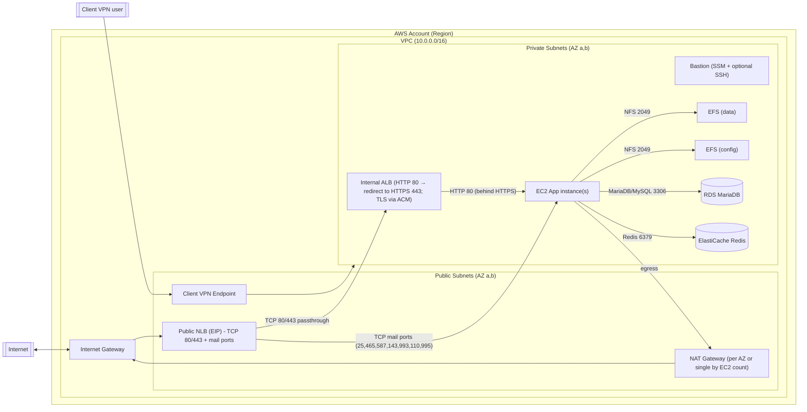

# Architecture diagram

Aktuální architektura: public a private subnets, public NLB s Elastic IP adresami, který předává porty 80/443 na interní ALB; NAT Gateway pro egress privátních instancí.

Legend
- Public subnets: NLB (EIP), NAT GW, Client VPN assoc.
- Private subnets: Internal ALB, EC2, RDS, Redis, EFS, Bastion (bez veřejné IP; přístup přes SSM; SSH volitelně dle flagu).
- Egress z privátních EC2 jde přes NAT Gateway do Internetu.
- S3 Gateway VPC Endpoint je připojen k private route tables.

Notes
- CIDR pro `public_subnets` a `private_subnets` jsou v `variables.tf`.
- NAT pravidlo: když `ec2_instance_count <= 1`, vytvoří se jedna NAT GW v public[0]; když je `ec2_instance_count > 1`, vytvoří se NAT GW v každé public subnet a private RTs routují per‑AZ.
- EFS MT pravidlo: když `ec2_instance_count <= 1`, EFS má mount target jen v první private subnet; jinak v každé private subnet (per‑AZ).
- Security Groups definované v `network.tf` omezují provoz; ICMP v rámci VPC je povolen pro diagnostiku.
 - SSH přístup: když `enable_ssh_access = true`, otevře se port 22 v SG pro EC2 (`allowed_ssh_cidr`) a volitelně i pro bastion SG.
 - Hostname: EC2 app i bastion si při bootstrapu nastaví hostname podle Name tagu a zachovají jej napříč rebooty.
