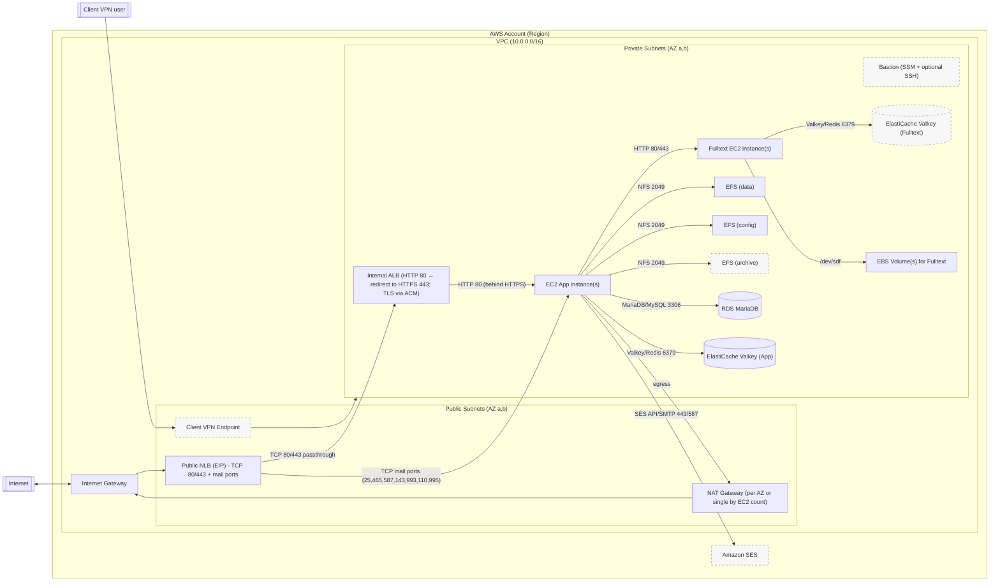

# Architecture diagram

Aktuální architektura: public a private subnets, public NLB s Elastic IP adresami, který předává porty 80/443 na interní ALB; NAT Gateway pro egress privátních instancí.

Legend
- Public subnets: NLB (EIP), NAT GW, Client VPN assoc.
- Private subnets: Internal ALB, EC2, RDS, Valkey (App/Fulltext), EFS, Bastion (bez veřejné IP; přístup přes SSM; SSH volitelně dle flagu).
- Egress z privátních EC2 jde přes NAT Gateway do Internetu.
- S3 Gateway VPC Endpoint je připojen k private route tables.
- Uzly se zvýrazněným (čárkovaným) okrajem jsou nepovinné a vytvářejí se jen při zapnutí příslušných voleb (např. EFS archive, Valkey pro Fulltext).

- Vždy nasazeno: VPC, public/private subnets, IGW, NLB, ALB (internal), EC2 App, RDS, Valkey (App – single/HA dle počtu app instancí), EFS (data, config), NAT (single nebo per‑AZ podle `app_instance_count`).
- Volitelné: Bastion (SSM‑only), Client VPN endpoint, EFS archive, Valkey (Fulltext, HA), Amazon SES, Fulltext EC2 + jeho EBS svazky (dle `fulltext_instance_count`).
 - Amazon SES: volitelný; aplikace odesílá přes AWS SDK (HTTPS) nebo SMTP, odesílatel musí být ověřen (email/doména, DKIM doporučeno).

Notes
- CIDR pro `public_subnets` a `private_subnets` jsou v `variables.tf`.
- NAT pravidlo: když `app_instance_count <= 1`, vytvoří se jedna NAT GW v public[0]; když je `app_instance_count > 1`, vytvoří se NAT GW v každé public subnet a private RTs routují per‑AZ.
- EFS MT pravidlo: když `app_instance_count <= 1`, EFS má mount target jen v první private subnet; jinak v každé private subnet (per‑AZ).
- Valkey (App): když `app_instance_count <= 1`, jednonodový cluster; když `app_instance_count > 1`, Multi‑AZ replication group s automatickým failoverem.
- Valkey (Fulltext): vytváří se jen když `fulltext_instance_count >= 2` a nasazuje se jako Multi‑AZ replication group.
- Security Groups definované v `network.tf` omezují provoz; ICMP v rámci VPC je povolen pro diagnostiku.
 - SSH přístup: když `enable_ssh_access = true`, otevře se port 22 v SG pro EC2 (`allowed_ssh_cidr`) a volitelně i pro bastion SG.
 - Hostname: EC2 app i bastion si při bootstrapu nastaví hostname podle Name tagu a zachovají jej napříč rebooty.
