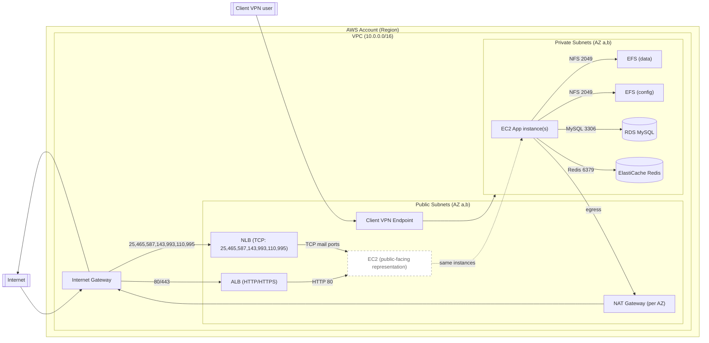

# Architecture diagram

Below is a Mermaid diagram showing the components and how they connect within AWS.

Legend
- EC2P is jen vizuální zobrazení EC2 „na hraně“ veřejné vrstvy (ve skutečnosti běží v private subnets, publikováno přes ALB/NLB).
- ALB terminates HTTP/HTTPS a předává HTTP 80 na EC2.
- NLB předává TCP pro mail protokoly přímo na EC2.
- EC2 mountuje obě EFS (data/config) přes NFS 2049.
- EC2 přistupuje k RDS na 3306 a k Redis na 6379.
- Egress z EC2 jde přes NAT Gateway do Internetu.
- Client VPN endpoint umožňuje přístup do VPC subnetů.

Notes
- Skutečné názvy AZ a subnet CIDRs jsou v `variables.tf`.
- Security Groups omezují provoz dle konfigurace v `network.tf`.
