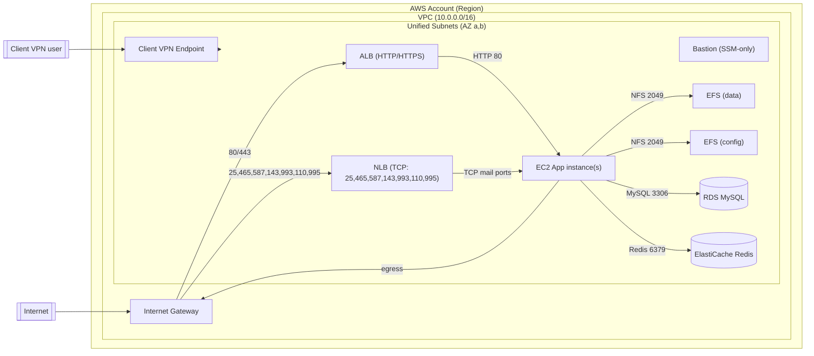

# Architecture diagram

Následující Mermaid schéma zobrazuje architekturu po přechodu na jednu síť (sjednocené subnety, bez NATu a bez rozlišení public/private).

Legend
- Jediná sada „Unified Subnets“ slouží všem komponentám (ALB, NLB, EC2, RDS, Redis, EFS, Client VPN).
- ALB terminates HTTP/HTTPS a posílá HTTP 80 na EC2.
- NLB předává TCP pro mail protokoly přímo na EC2.
- EC2 mountuje EFS (data/config) přes NFS 2049; přistupuje k RDS (3306) a Redis (6379).
- Egress z EC2 jde přímo přes Internet Gateway (bez NAT Gateway).
- Client VPN endpoint je asociován do sjednocených subnetů.

Notes
- CIDR rozsahy sjednocených subnetů nastavíte ve `variables.tf` (`var.subnets`).
- Security Groups definované v `network.tf` omezují příchozí/příchozí provoz; povolen je ICMP v rámci VPC pro diagnostiku.
- Pro S3 je zřízen Gateway VPC Endpoint na route table sjednocené sítě (omezuje egress přes Internet).
